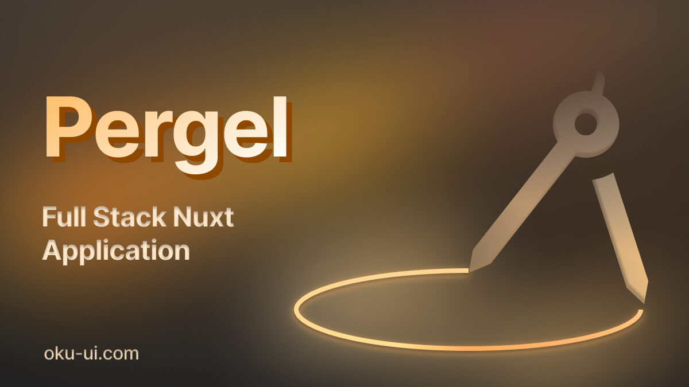

<h1 align='center'>Pergel</h1>

  

🚀 Pergel Project: Accelerate Your Full-Stack Development with Nuxt and Nitro!

Pergel is a tailor-made solution for Nuxt and Nitro, providing swift project kickstarts and seamless integration of various modules. Named with a Turkish touch, Pergel maximizes the power of TypeScript, streamlining and accelerating your project development process.

| Package | Version | Downloads |
|---------|---------|-----------|
| [CLI](https://www.npmjs.com/package/pergel) |  |  |
| [Nuxt Module](https://www.npmjs.com/package/@pergel/nuxt) |  |  |

🧰 Modular and Packaged Structure

Pergel encompasses the core structure of your project, offering essential modules and packages to kickstart your development journey. This allows you to build the foundational infrastructure for your project with an advanced and modular approach.

🚨 Proactive Module Additions

Pergel is continuously evolving to meet your future needs. We consistently add new modules and packages to keep your projects up-to-date and competitive, ensuring a proactive and future-ready development environment.

🚀 Empowered Development with TypeScript

Pergel seamlessly integrates with TypeScript, providing developers with type safety and the advantages of the compilation process. This results in safer, more readable, and sustainable projects.
🌐 Community-Driven Growth with Feedback

Pergel is a community-centric project. Engage with fellow developers and users to help us make Pergel better and more powerful. Your feedback plays a critical role in making Pergel more user-friendly and functional.

💡 Join In and Progress

If you're a developer, explore Pergel to enhance your projects. You can also contribute to our community by integrating the structures you use in your projects into Pergel and submitting pull requests.

Feel free to share your suggestions or change requests regarding Pergel. Together, let's create a better and more robust development experience!

🚀 Push Boundaries, Invest in the Future with Pergel!

# Contributing

Please read our [contributing guide](https://github.com/oku-ui/pergel/blob/master/CONTRIBUTING.md)

# TODO

- [] Add tests
- [] Add more examples
- [] Add more documentation
- [] Add more modules (GraphQL, Drizzle, nodecron, BullMQ, SES, etc.)

## Community

- [Discord](https://chat.productdevbook.com) - To get involved with the Oku community, ask questions and share tips.
- [Twitter](https://twitter.com/oku_ui) - To receive updates, announcements, blog posts, and general Oku tips.

## Sponsors

  

## Credits

Thanks to

- [Nuxt](https://nuxtjs.org/)
- [Harlan Wilton](https://github.com/harlan-zw) For getting back to me with every question and for helping me.
- [Daniel Roe](https://github.com/danielroe) His wonderful live broadcasts helped me to improve myself. He's a great teacher.

## License

Licensed under the MIT License, Copyright © 2023-present [productdevbook](https://twitter.com/productdevbook).

See [LICENSE](./LICENSE) for more information.